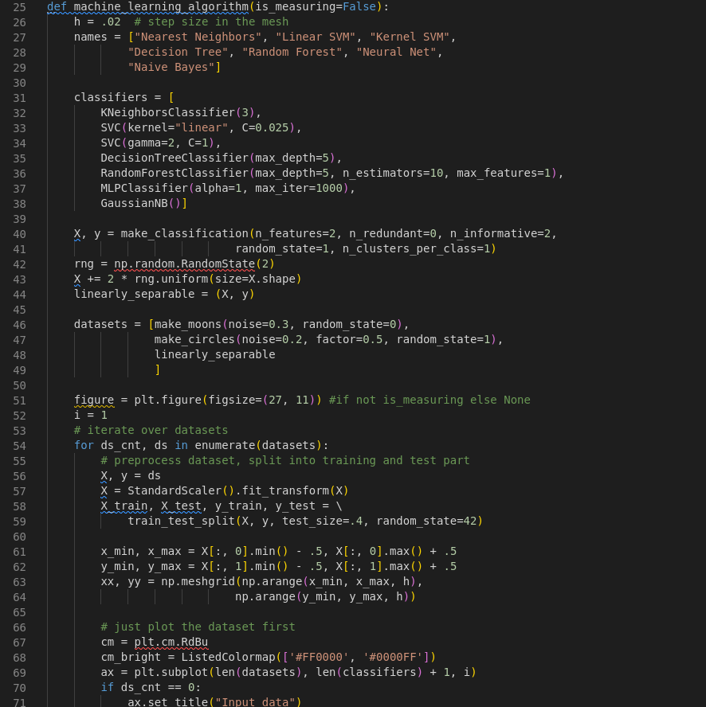
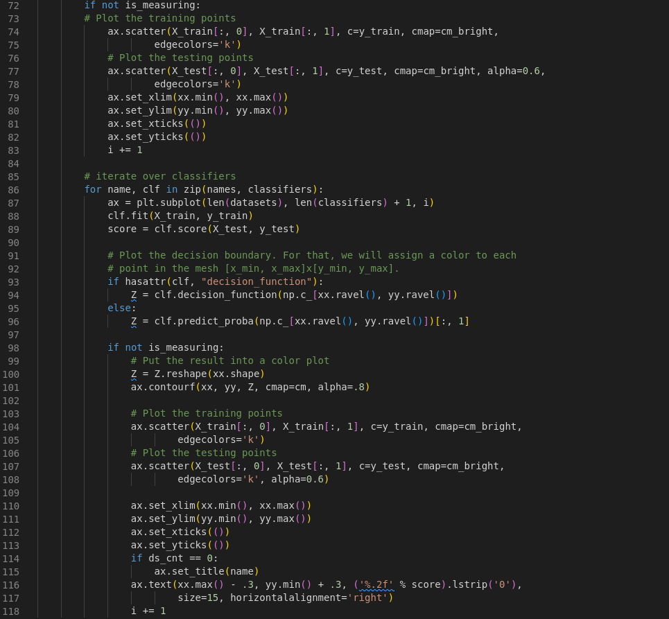

# Zweite Übung: It`s Time for Machine Learning 

# Beschreibung
Dieser Ordner enthält den Code und die Lösungen für die Fragen auf dem Übungsblatt 2 It`s time for Machine Learning.
Die Antworten stehen dabei in diesem README.


# wichtige Schritte in dem Code: 



- Zeile 30 - 38: initalisiere die benutzten  ML Methoden mit ihren jeweiligen Parametern
    - Knearest Neighbor bei für die Klassifikation eines Punktes jeweils seine 3 Nachbarn berücksichtigt werden 
    - SVC mit einem linaren Kernel und einem regularization parameter $C=0.025$
    - SVC mit einem rbf Kernel mit $\gamma$=2,regularization parameter $C=1$
    - Decision Tree Classifier 
    - Random Forest Classifier 
    - Ein neuronales Netz das mit 1000 Iterationen über die Trainingdaten trainiert wird 
    - Gaussian Naive Bayes


- Zeile 39: lasse ein zufälliges Datenset von sklearn erzeugen mit zwei nicht redudanten
  Feautures und zwei Klassen die jeweils ein Cluster haben

- Zeile 45: erzeuge drei weitere Datensets mit sklearn und füge das in Zeile 39 erzeugte Datenset hinzu, jedes Datenset besteht aus einem Array von samples und dem dazugehörige Klassenlabel 

- Zeile 56: hier findet das Preprocessing statt: diese Daten werden als Vektoren repräsentiert und anschließend wird der Mittelwert der Repräsentationen abgezogen und schlussendlich skaliert  mit der Standardvarianz der gewählten Repräsentation 

- Zeile 57: teilt das Datenset auf: $\frac{3}{4}$ des Datenset werden Trainingsdaten und der Rest sind Testdaten. Beide sind aufgeteilt in die tatsächlichen Daten und ein dem Daten zugewiesenes Label.

- Zeile 60-62: erzeugt ein (x_max -x_min) * (y_max-y_min) großes Rechteck das jede Kombinastion von x und y zwischen  (x_max -x_min) und (y_max -y_min) enthält.
Dieses Rechteck wird später genutzt um darauf die Trainings- und Testdaten zu zeichnen.

- Zeile 84 -115: iteriert über jeden oben erstellen Classifier und den Namen und
  plottet die Decision boundary,die Trainings und Testdaten und  nimmt noch eine Achseneinteilung und eine Achsenbeschriftung vor. 
  Zwei Zeilen sind in dem Abschnitt dabei besonders relevant:
  - Zeile 86: trainiere den in der aktuellen Iteration ausgewählten Classifier auf den Trainingsdaten
  - Zeile 87: hier wird evaluiert, dafür wird die durschnittliche Accuary des in der aktuellen Iteration ausgewählten Classifier auf den Testdaten berechnet


# Zeitmessung des Codes:
## Code für die Zeitmessung:
```
execution_times = timeit.Timer("machine_learning_algorithm(is_measuring)",
                              "from __main__ import machine_learning_algorithm,is_measuring")
                              .repeat(20,1)
```
## Zeitmessung: 
| Messung Nr.| Benötigte Zeit in Sekunden,gerundet auf 4 Nachkommastellen|
|------------|--------|
|1-5|1.417,1.5673, 1.9932, 2.0084, 1.9993
|6-10|1.9804,1.9713,1.9988,2.0235,2.036|
|11-15|1.9739,2.0129,2.0481,2.057,2.0684,
|16-20| 2.1599,2.0879,2.1161,2.0243,2.0005|


Die kürzeste Zeit für das Ausführen des Skriptes beträgt 1.417 Sekunden gerundet auf 4 Nachkommastellen. Der Mittelwert über 20 Messungen ist dabei 1.9772 mit einer Standardabweichung von 0.1701 Sekunden.
Bei allen Messungen wurde die Zeit für das Erstellen und Anzeigen der Graphen nicht miteinbezogen.
Diese mussten für die wiederholte Messung in Schritt 3 entfernt werden da es zu einer Perfomance Warning kam. Um die Ergebnisse miteinander vergleichen zu köpnnen 
wurde dieser Schritt auch für die einmalige Zeitmessung ignoriert.

Die relevanten Hardware Komponenten sind
  - keine externe Grafikkarte
  - eine SSD 
  - 16 GB RAM 
  - Core i7 mit 8 Kernen @1,8 GHZ

## Genügt eine einmalige Zeitmessung ?
Eine einmalige Zeitmessung ist nicht ausreichend denn die Zeitmessung hängt von der aktuellen Zustand der Hardware ab. Beispielsweise beeinflusst die Anzahl an gerade laufenden Prozessen die aktuelle Gesamtauslastung der CPU ebenso wie ggf.gerade laufende Hinterprozesse. Durch das mehrmalige Messen kann der Einfluss der oben genannten Faktoren verringert werden da die Messungen jeweils unter verschiedenen Zuständen der Hardware z.B. 
unterschiedlicher CPU Auslastung zum Testzeitpunkt ablaufen. Dies könnte uns über das Testen von ML Algorithmen sagen,dass die absoluten Ausführungsdauer verschiedener ML Algorithmen nicht miteinander verglichen werden können aber beispielsweise relative Angaben wie ist 2-3x mal schneller sind durchaus möglich.


## Fragen zu den Visualisierungen der verschiedenen ML Algorithmen: 
### Unterschiede zwischen den verschiedenen Datensätzen:
Die Punkte aller drei Datensätze wurden in 2 Klassen,rot und blau eingeteilt und bei allen Datensätzen sind die Punkte die zum Testdatenset gehören halb transparent.
Das zweite Datenset besteht aus zwei ineinanderverschachtelte Halbmonde wohingegen sich für das dritte Datenset die meisten Datenpunkte auf der rechten Seite für die rote Klasse bzw. auf der linken für die blaue Klasse befindet. Für das erste Datenset befinden sich die meisten Punkte für die rote Klasse in der linken oberen Ecke,die meisten Punkte für die blaue Klasse dagegen in 
der rechten unteren Ecke.
### Unterschiede bei der Decision Boundary der verschiednene Algorithmen:
Die Decision Boundary für SVM teilt die Daten in Streifen auf wogegen bei Decision Tree die Decision Boundary und Random Tree eine rechteckige Form hat. Die restlichen Decision Boundaries 
haben die Form von Kreisen
### Was bedeutet linear seperable ?
linear seperable ist eine Eigenschaft von 2 Mengen und zwar, dass eine Hypereben im n-dimensionalen Raum existiert die diese voneinander trennt. Von den drei Datensätzten ist nur das letzte Datenset linear separierbar 