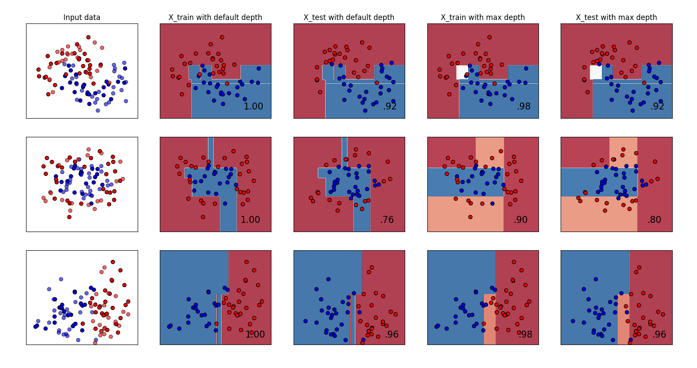
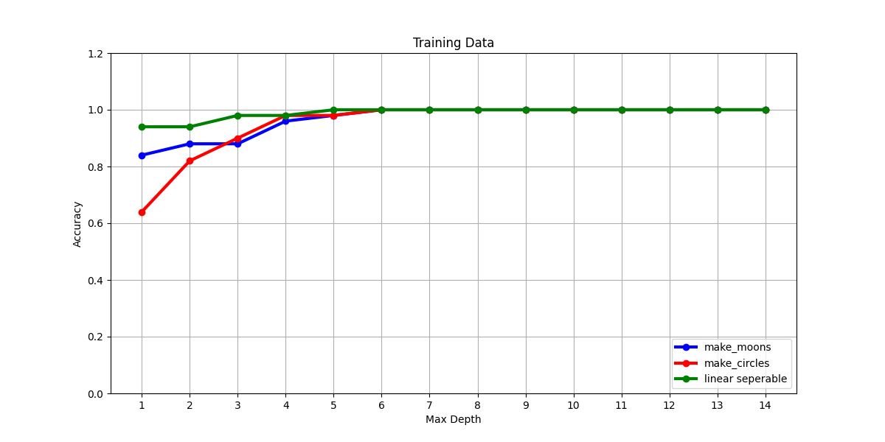
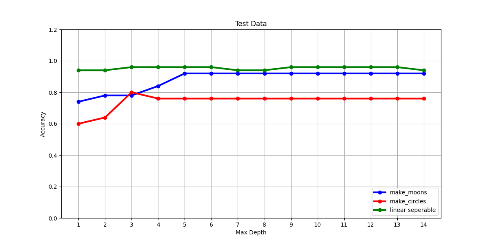
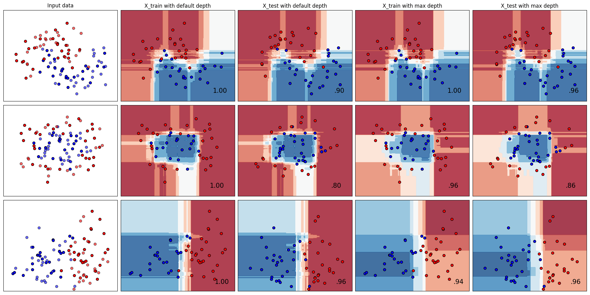
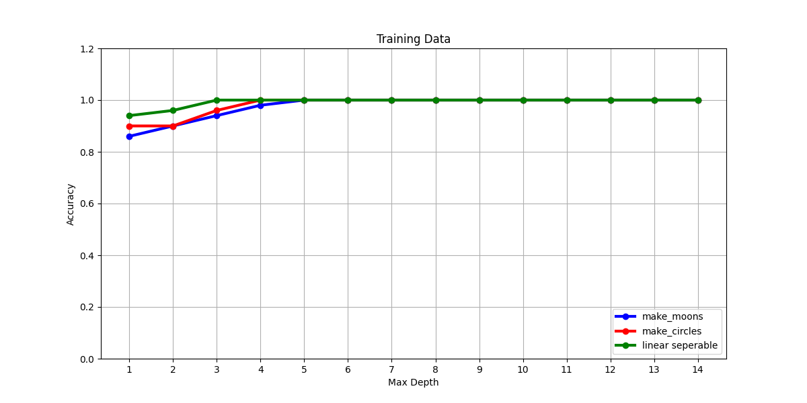
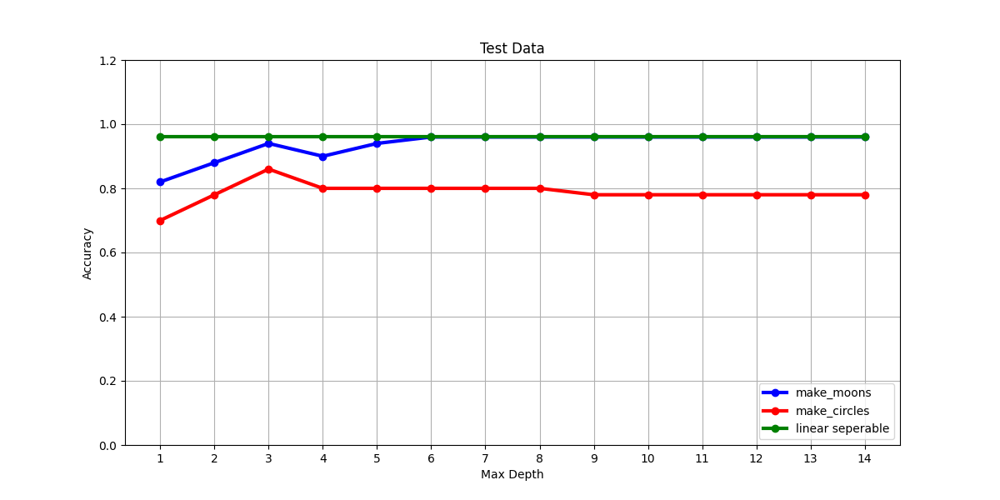
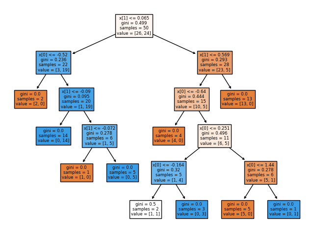

# 03 Übung 
## Beschreibung
Dieser Ordner enthält die Lösungen für das Übungsblatt 3 Decision Trees

## Fragen zum Code für Decision Trees/Random Forests : 
### Welche Vorhesagen macht der Classifier ?
  Der Decision Tree Classifier sagt für die drei Datensets jeweils das Label 0 oder 1 für jedes sample aus X_train vorraus.

### Accuracy auf den drei verschiedenen Datensets mit dem Default Parametern 

|Datenset                         |Genauigkeit auf X_test   |Genauigkeit auf X_train|
|:---------------------------------:|:----------------------:|:--------------------:| 
| make_moons                      | 0.92               | 0.98 
| make_circles                  | 0.8                 | 0.9 
| linear seperierbares Datenset | 0.96               | 0.96              |

Für das erste Datenset sind 92%, für das zweite Datenset 80% und für das dritte Datenset 96% der Vorhersagen richtig.

### Plots
#### Decision Tree

Random Forest

Decision Tree mit optimaler Tiefe für das Datenset make moons:

### Was bedeutet eine optimale maximale Tiefe ? Bezieht sich das optimal auf das Test oder auf das Trainingsdatenset ? 
Eine optimale Tiefe des Decision Tree bedeutet, dass die Genauigkeit auf dem Testdatenset möglichst hoch ist,denn ein
Decision Tree mit nur pure Nodes also mit maximaler Tiefe erreicht die höchste Genauigkeit wie in der Tabelle oben zu sehen ist.
Das liegt daran,dass der Baum dann auf den Trainingsdaten overfittet wird. Außerdem ist die Tiefe ein Hyperparameter der die
Generalierungsfähigkeit des Baums steuert und diese sollte auf neuen Daten optimiert werden und nicht auf bereits im Training
gesehene.

### Beschreibung des Plots für die verschiedenen max_depths des Decision Trees:
Mit der Default Wert teilt die decision boundary das Testdatenset fast genau in die zwei Bereiche rot und blau, was zu der Genauigkeit von 100% auf dem Trainingsdatenset führt.
Das führt dazu, dasss auf anderen Daten mit gleicher Verteilung die Genauigkeit sinkt,
was sich  im Plot an den Punkten erkennen,die in der falsch eingefärbten Fläche liegen
erkennen lässt. Das gleiche Phänomen lässt sich auf den  Trainingsdatenset beobachten
wenn der max_depth Parameter so gesetzt wurde,dass nicht alle Knoten im Baum pure Nodes sind. Dies führt dann zu einer niedrigeren Genauigkeit auf dem Trainingsdatenset.

### Wie unterscheiden sich die Ergebnisse des Decision Tree von denen des Random Forest ? 
Die Decision Boundary bei dem Random Forest ist keine gleichmäßige Fläche sondern eine zerstückelte FLäche die in manchen Fällen getrennt voneinander liegen. Dies liegt daran,
dass in diesem Fall 100 verschiedene Decision Trees kombiniert wurden die jeder eine ggf.sich überschneidende Decision Boundary festlegen. Selbst mit einem Random Forest der nur aus pure Nodes besteht,der Defaultwert in sklearn, konnten auf dem Testdatenset die Genauigkeit der vorherigen Ergebnisse übertroffen werden. Da der Random Forest  nur aus pure Nodes besteht konnte wie bei den Decision Trees mit nur pure Nodes eine Genauigkeit von 100% auf dem Trainingsdatenset erzielt werden.

## mögliche Projektidee
- Problem: Die Stimmung eines Songs als Wert zwischen 0 und 1 vorhersagen 
- Features:Geschwindigkeit in bpm,Lautstärke,Tanzbarkeit und vielleicht noch die Tonart und Songname 
- Repräsentation: 
  - als double zwischen 0 und 1:Stimmung,Geschwindigkeit,Lautstärke,Tanzbarkeit, dabei gilt je höher der Wert desto höher ist das Attriut ausgeprägt 
  - Tonart als int zwischen 0 und 11 da die Höhe des Tons für die Tonart unwichtig ist  
- Performanz messen: mit Accuracy oder Recall,vermutlich ist Recall eher besser da 
  möglicherweise bestimmte Stimmungen wie fröhlich häufiger sind. Das könnte dazu 
  führen,dass die Accuracy hoch wird in dem das Modell immer die häufigeren Stimmungen vorhersagt
- Datenset verfügbar unter https://www.kaggle.com/datasets/joebeachcapital/30000-spotify-songs

## Pro und Contra Argumente um das Problem mit einem Decision Tree zu lösen 
| Pro |Contra
|:----|:-----| 
| vermutlich lassen sich einige Regeln aufstellen z.B. hohe Lautstärke und schnelles Tempo -> Der Song hat tendenziell eine positiviere Stimmung  | Stimmung kann Werte zwischen 0-1 annehmen -> Decision Tree könnte overfitten indem für jede mögliche Klasse ein pure Node erzeugt wird 
|Mit den 4-6 verwendeten  Features könnte der Decision Tree noch einigermaßen erklärbar bleiben|Decision Trees erreichen meistens nicht die Genauigkeit von linearer Regression Quelle:https://towardsdatascience.com/almost-everything-you-need-to-know-about-decision-trees-with-code-dc026172a284?gi=46219b399869|

