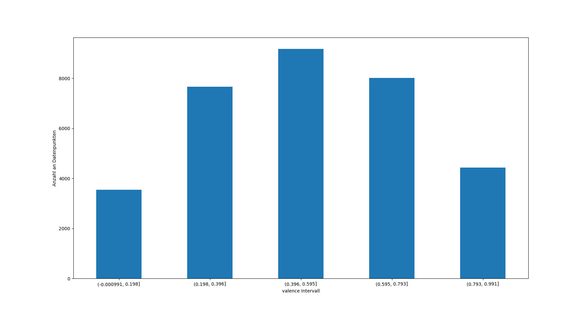
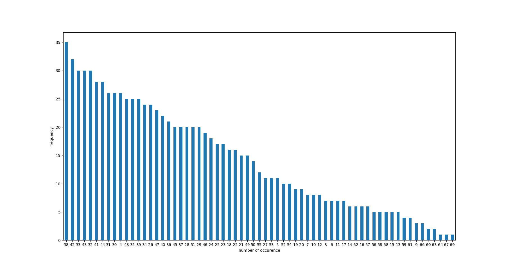
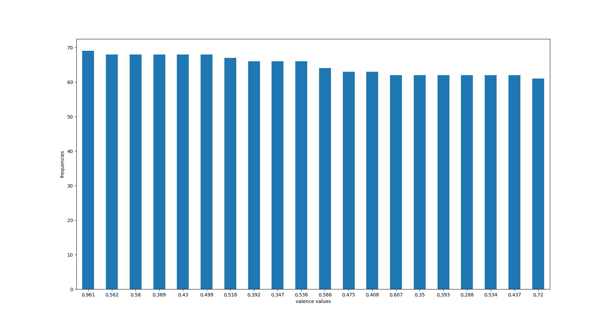

# 04  Übung 

## Beschreibung
Dieser Ordner enthält die Projekt Beschreibung

## Beschreibung der Datensplits
Das Datenset ist nicht gesplittet in Train/Dev/Test Anteile. Um das Datenset zu splitten,müssen zuerst
alle nicht notwendigen Spalten gelöscht werden. Danach kann mit einer sklearn Methode das Datenset in 75% 
Trainingsdaten und 15% Testdaten aufgeteilt werden.
Da das Datenset wie oben beschrieben nicht in Train/Dev/Test Sets aufgeteilt ist aber das Dev Set für das 
Training der Hyperparameter benötigt wird werde ich K fold Cross Validierung benutzten. 
Obwohl dabei ein Teil des Trainingsdatensets für die Validierung genutzt werden muss ist dies immer noch besser
als ein neues Validierungsset suchen zu müssen, dass dann möglicherweise auch nicht die vorgebene Größe von 15% des 
ursprünglichen Datensets hat.

## Werteverteilung für die Spalte "valence"

In dem Plot geht das erste Intervall über 0 hinaus, da [pd.cut]( https://pandas.pydata.org/pandas-docs/stable/reference/api/pandas.cut.html) aus der pandas Biblipthek zu dem ersten Intervall noch 0.1% dazuaddiert. 

| Wertebereich als linksoffenes Intervall      | Anzahl Datenpunkte
|----------------------------------------------|------|
| (0, 0.198]         | 3541 |
| (0.198, 0.396]     | 7668 |
| (0.396, 0.595]     | 9167 |
| (0.595, 0.793]     | 8012 |
| (0.793, 0.991]     | 4426 |
| gesamt             | 32814|

Es gibt insgesamt 1362 verschiedene Werte für die Valence, davon aber nur 68 verschiedene. Dabei treten 247 Werte nur einmal auf 
112 Werte nur 2x mal und 71 Werte nur 3x mal auf. 

Anzahl Datenpunkte pro Häufigkeit:

Die 20 häufigsten Werte für die Valence:

## Evaluierung der Baselines:
Alle Metriken wurden mit 5 facher Kreuzvalidierung durchgeführt
Dabei benutzt sklearn für die Kreuzvalidierung den negatierten Fehler
für die Vorhersage auf dem Testdatenset aber den nicht negierten Fehler.

(negativer) root Mean squared error:
| Baseline |Durschnitt über 5 Folds| Score auf dem Testdatenset
|----------|:--------------|----|
| Mean Baseline| -0.2325| 0.2348|
| Majority Baseline|-0.5078|0.5056
| Random Baseline mit zufälliger valence 0.402| -0.2550 | 0.2598

(negativer) absolute error: 

| Baseline |Durschnitt über 5 Folds|Score auf dem Testdatenset
|----------|:--------------|----|
| Mean Baseline| -0.1954| 0.1976
| Majority Baseline|-0.4515| 0.4479
| Random Baseline zufälliger valence 0.402|-0.2119 |0.21558|

Beide Metriken messen wie groß die Differenz ist zwischen dem vorhergesagten valence und der tatsächlichen valence des aktuellen Songs angeben in rationalen Zahlen zwischen 0 und 1 ist. Eine niedriger Wert bedeutet dabei,dass die Vorhersage des Modells recht gut war da die Differenz zwischen dem vorhergesagten und der Gold valence gering ist.
Die Mean Baseline hat dabei für beide Metriken am besten performt, da der Durschnitt etwa 0.51 ist und wiederum im Intervall der häufigsten Werte ist.
Die Majority Baseline hat am schlechsten abgeschnitten denn nur der häufigst Wert für die Valence,0.961 der 69x mal vorkommt liegt nicht in dem liegen nicht in dem häufigsten Intervall.
Da außerdem 5 Werte die 68x mal vorkommen wieder genau in dem häufigsten Intervall in dem auch die Mean Baseline liegt vorkommen ist dies eine weiterer Grund für das schlechtere Abschneiden der Majority Baseline.

# verschiedene Feature Kombinationen 
Alle Feature Kombinationen wurden mit einem Decision Tree und mit beiden Evaluationsmetriken evaluiert.

| Feature Kombination | relativer Unterschied zu einem DT mit allen Features | RMSE bei allen Features mit max_depth=7 |RMSE bei der Feature Kombination mit max_depth=7|
|---------------------| ------------------------------------------------------|-------------------------------|-----------------------------------|
| danceability, track_album_name, tempo, loudness| weniger als 0.01| -0,214282700637873| -0,2142479455475|
| danceability, track_album_name, tempo, mode| weniger als 0.03|-0,214282700637873|-0,214716215132004|-0,217908397257487|
| danceability, track_album_name, loudness, mode| weniger als 0.04|-0,214282700637873|-0,217908397257487|
| danceability, tempo, loudness, mode| weniger als 0.05|-0,214282700637873| -0,215031645754395|
| track_album_name, tempo, loudness, mode| weniger als 0.05|-0,214282700637873|-0,225688084349699|

