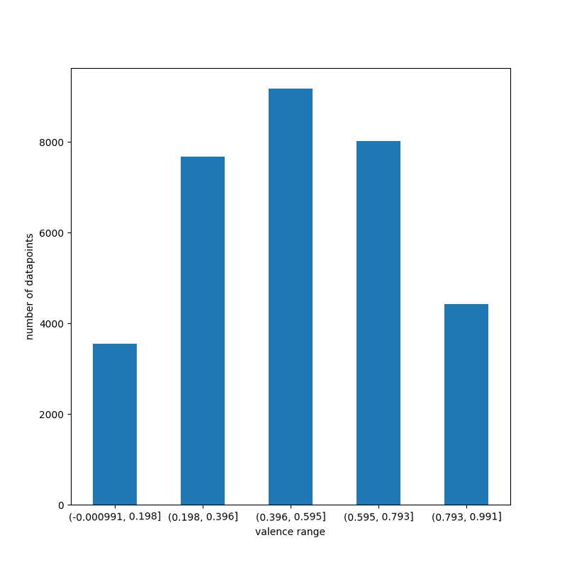

# 04  Übung 

## Beschreibung
Dieser Ordner enthält die Projekt Beschreibung

## Beschreibung der Datensplits
Das Datenset ist nicht gesplittet in Train/Dev/Test Anteile. Um das Datenset zu splitten,müssen zuerst
alle nicht notwendigen Spalten gelöscht werden. Danach kann mit einer sklearn Methode das Datenset in 75% 
Trainingsdaten und 15% Testdaten aufgeteilt werden.
Da das Datenset wie oben beschrieben nicht in Train/Dev/Test Sets aufgeteilt ist aber das Dev Set für das 
Training der Hyperparameter benötigt wird werde ich K fold Cross Validierung benutzten. 
Obwohl dabei ein Teil des Trainingsdatensets für die Validierung genutzt werden muss ist dies immer noch besser
als ein neues Validuerungsset suchen zu müssen, dass dann möglicherweise auch nicht die vorgebene Größe von 15% des 
ursprünglichen Datensets hat.

## Werteverteilung für die Spalte "valence"

In dem Plot geht das erste Intervall über 0 hinaus, da [pd.cut]( https://pandas.pydata.org/pandas-docs/stable/reference/api/pandas.cut.html) aus der pandas Biblipthek zu dem ersten Intervall noch 0.1% dazuaddiert. 

| Wertebereich als linksoffenes Intervall      | Anzahl Datenpunkte
|----------------------------------------------|------|
| (0, 0.198]         | 3541 |
| (0.198, 0.396]     | 7668 |
| (0.396, 0.595]     | 9167 |
| (0.595, 0.793]     | 8012 |
| (0.793, 0.991]     | 4426 |
| gesamt             | 32814|

## Evaluierung der Baselines:
Alle Metriken wurden mit 5 facher Kreuzvalidierung durchgeführt
Dabei negiert sklearn den Mean squared error und den absoluten Fehler
sodass höhere Fehler besser sind.

negativer root Mean squared error:
| Baseline |Durschnitt über 5 Folds|Datenset
|----------|:--------------|----|
| Mean Baseline| -0.2325| Train
| Mean Baseline| -0.1954| Test
| Majority Baseline|-0.5078| Train 
| Majority Baseline | -0.4515| Test 
| Random Baseline mit zufälliger valence 0.131|-0.4443 |Train
| Random Baseline mit zufälliger valence 0.131| -0.3831| Test

negativer absolute error: 

| Baseline |Durschnitt über 5 Folds|Datenset
|----------|:--------------|----|
| Mean Baseline| -0.1954| Train
| Mean Baseline| -0.1954| Test
| Majority Baseline|-0.4515| Train 
| Majority Baseline | -0.4515| Test 
| Random Baseline zufälliger valence 0.131|-0.3831 |Train
| Random Baseline mit zufälliger valence 0.131| -0.3831| Test

Wie erwartet, sind die Metriken höher auf dem Trainingsdaten als auf dem Testdaten. Das liegt daran, dass alle Baselines 
darauf gefittet wurden weshalb z.B. bei der Majority Baseline immer der häufigste Wert des Trainingsdatenset vorrausgesagt wird. 
Die Mean Baseline hat dabei für beide Metriken am besten performt, da beide Metriken die Distanz zwischen den tatsächlicneWert und den vorhersagten Wert berechnen 
und  der Durschnitt etwa 0.51 ist, was in dem Intervall der häufigsten Werte liegt. Aus dem gleichen Grund hat die Majority Baseline am schlechtsten performt denn 
der häufigste Wert für die Valence liegt bei 0.961.