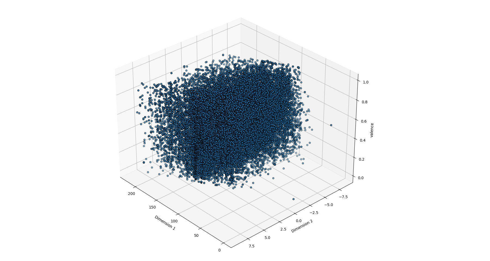
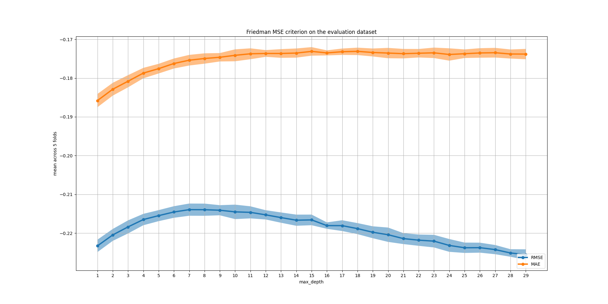

# finales Projekt  
## Inhaltsverzeichnis
- [Ziele](#Ziele)
- [Motivation](#Motivation)
- Datenset  
    - [Überblick über das Datenset](#Überblick-über-das-Datenset)
    - [Feature Auswahl](#Feature-Auswahl)
    - [Preprocessing](#preprocessing)
    - [Train-Test Split](#train-test-split)
    - [Daten Verteilung](#datenverteilung)
- Experimente 
    - [DT](#Decision-Tree)
    - [Random Forest](#random-forest)
    - [lineare Regression](#lineare-regression)
    - [Neuronal Network](#neuronal-network)
- Evaluierung 
    - [Baselines](#evaluierung-der-baselines)
    - [Modell Evaluation](#evalierung-der-modelle)
    - [Feature Importance](#feature-importance)
- Ausblick
    - [mögliche Anwendung](#mögliche-anwendung-Songs-vorschlagen)

## Ziele 
Das Ziel des Projekt ist es die Stimmung eines Songs als reelle Zahl zwischen 0 und 1 vorherzusagen wobei 
die Stimmung positiver ist je größer die Zahl ist. Dabei wird für das Training ein Datenset von Kaggle mit Spotify
Songs benutzt es handelt sich also um Supervised Learning regression Problem. Daraus ergibt sich eine naheliegende Anwendungsmöglichkeit
und gleichzeitig auch eine Motivation des Projekts nämlich auf Basis der vorhergesagten Stimmung einem potenziellen User weitere Songs zu empfehlen.
Dies ist auf Spotify durchaus relevant für z.B. Themenplaylists wie "Winter mood" oder Playlists die bestimmte Gefühle wecken sollen wie z.B. eine Playlist mit dem Namen"Stimmungsmacher". Außerdem können für den User passende Songvorschläge dazuführen, dass ein User potenziell länger Spotify nutzt,was durchaus 
im Sinne von Spotify ist.

## Motivation
Im Gegensatz zu der meisten Literatur die ich zu diesem Thema gefunde habe beschäftigt werden die Songs nicht klassifiziert sondern 
es handelt sich um Regressionsproblem. Zunächst einmal gibt es dafür den pragmatischen Grund,dass ich kein Datenset gefunden habe, dass
Spotify Songs in Kategorieren einteilt sondern verschiedene Datensets mit Musik aus Indien sowie Datensets mit Musik aus unterschiedlichen Quellen aber
nicht von Spotify. Eine Übersicht dazu gibt es unter [diesem Link](https://github.com/juansgomez87/datasets_emotion).
Dazu habe ich verschiedene wissenschaftliche Quellen gefunden die vorschlagen diese Kategorien für eine Empfehlung von Song zu benutzten.
Der Vorteil bei dem gewählten Datenset ist,dass es von der Spotify API stammt und dadurch die vorhergesagten Werte für die Stimmung 
genutzt werden können um mithilfe der Spotify API Vorschläge zu bekommen und diese dann zu vergleichen mit den Vorschlägen basierend 
auf der tatsächlichen(gold label) Stimmung. 

## Überblick über das Datenset 
Das Datenset enthält 32 verschiedene Features von Songs die zwischen 1960 und 2020 auf Spotify veröffentlicht wurden.
Davon habe ich mir folgende fünf Features ausgesucht.

|track_name	|danceability|tempo|key|mode|valence|
|-----------|------------|-----|---|----|-------|
|Seven Nation Army|0.753|123.913|0|1|0.297|
It's Only Time|0.397|220.252|5|1|0.247|
|cold nights|0.491|49.597|9|0|0.602|
|Decade|0.549|120.994|6|1|0.14|

Dabei ist die danceability ein Wert zwischen 0 und 1 wobei gilt je höher ein Wert desto tanzbarer ist ein Song.
Das Tempo eines Songs ist Beats per minute (bpm) angeben wobei das angebene Tempo das Durschnittstempo des Songs ist.
In dem Datenset kommen dabei für die bpm Werte zwischen 30 und 230 bpm auf, wobei die meisten Werte zwischen 
120 und 130 bpm liegen.
Die Tonart(key) ist dabei als Ganzzahl zwischen 0 und 11 angeben, wobei jede Ganzzahl einer der 12 Halbtonschritte einer
Tonleiter repräsentiert. Zuletzt ist das Tongeschlecht( im Englischen mode) entweder 0,für moll oder 1 für Dur.

## Feature Auswahl
Das Feauture Tempo eines Songs wurde ausgewählt,da schnellere Songs,also jene mit einer höheren bpm, tendenziell vermutlich eine positivere Stimmung besitzt.
Zum Beispiel hat der Song `Seven Nation Army` mit 123 bpm ein Tempo deutlich über der Herzfrequenz von ca.70 bpm liegt,kann diese Song als eher aufputschend 
beschrieben werden kann. Analog wurde das Feature Tanzbarkeit ausgewählt, hier ist die Überlegung dass,ein postivere Song vermutlich eher tanzbarer ist.
Bei dem Song Namen war die Überlegung,dass dieser einen Song gewissermaßen zusammenfassen soll und dadurch Hinweise auf die 
Stimmung gibt. Zudem enthalten manche Songs direkte Hinweis auf eine bestimmte Stimmung z.B.wenn ein Songtitel das Wort Remix 
enthält hat er vermutlich eine eher positive Stimmung. 

Das Tongeschlecht wurde ausgewählt da Dur im Gegensatz zu Moll eher fröhlich klingt also tendenziell bei Songs mit einer positiveren 
Stimmung benutzt wird. Die Tonart wurde ausgewählt weil bestimmten Tonarten bestimmten Attributen zugewiesen werden wie z.B.leicht für C-Dur
die ebenfalls einen auf die Stimmung haben können. Allerdings ist die Zuschreibung umstritten und der wesentlichere Grund ist,dass
das ursprünglich geplante Feauture Laustärke in db nicht genutzt weden da es selbst mit einer Skalierung nicht möglich war die 
Werte in das in dem [README des Datensets](data/readme_dataset.md) angebene Intervall zwischen -60 und 0 zu bringen. 

## Preprocessing
Bevor das Datenset zum Trainieren genutzt werden konnte musste es in 3 Schritten aufbereitet werden.
Zunächst einmal mussten einige Wörter aus den 4 Feature Spalten mit numerischen Werten entfernt werden.
Danach mussten die Wertebereiche für die Features danceability,valence  und tempo zwischen 0 und 1 skaliert 
werden,denn ursprünglich waren,anders als im [README des Datensets](data/readme_dataset.md) angeben einige Werte nicht zwischen 0 und 1. 
Dabei sind leider einige sehr kleine Werte für die Valence entstanden z.B.0,0064 die zwar prinzipiell möglich sind
aber für sich genommen wenig Sinn ergeben. Nach diesen Schritten sind den ursprünglich 32.833 Songs noch 
32.714 Songs verblieben. Als letzten Schritt musste der Songname mit TF-IDF noch in Vektoren umgewandelt werden damit 
er als Input für ein ML Modell dienen kann.

## Train-Test Split  
Das Datenset wurde gesplittet in 60% Trainingsdaten und 25% Testdaten.
Aus den Trainingsdaten wurde mit 5-facher Kreuzvalidierung ein Evaluierungsdatenset 
erstellt das insgesamt 15% des Datenset ausmacht. Obwohl bei diesem Vorgehen ein Teil des Trainingsdatensets
für die Validierung genutzt werden muss ist dies immer noch besser als ein neues Validierungsset suchen zu müssen, 
dass dann möglicherweise auch nicht die vorgebene Größe von 15% des  ursprünglichen Datensets hat.

## Datenverteilung 
Zuerst wurden mithilfe von Truncated SVD die vier ausgewählten Features zur besseren Visualisierung auf 2 Dimensionen reduziert.
Das Ergebnis ist in den beiden Plots unten zu sehen,wobei in der 2D Darstellung transparente Punkte zu den Testdatensatz gehören.
 
 

Die beiden Plots illustrieren dabei,dass die Werte für die Valence bis auf wenige Ausnahmen gleichmäßig verteilt sind, in keiner der beiden Dimensionen 
sammeln sich die Werte an einem Punkt oder an einem der beiden Minima bzw. Maxima. Die einzigen Aureißer sind Datenpunkte bei der die valence 0 ist nahe dem Ursprung und dem Punkt(x_max,y_max). 

Als nächstes schauen wir uns die Verteilung der Valence unabhängig von den Features an. Dabei geht in dem Plot  das erste Intervall über 0 hinaus, da [pd.cut]( https://pandas.pydata.org/pandas-docs/stable/reference/api/pandas.cut.html) aus der pandas Biblipthek zu dem ersten Intervall noch 0.1% dazuaddiert. Dies hat aber keine Einfluss auf die Anzahl an Datenpunkte
da der minimale Wert für die valence 0 ist. Bei dem Plot fällt auf,dass die Verteilung der Werte einer Glockenkurve ähnelt, mit den meisten Werten,9167 Songs, im Intervall welches den Mittelwert von ca 0.51 enthält. Allerdings sind im dem Intervall rechts des mittleren mit 8012 Songs deutlich mehr Datenpunkte enthalten 
als im dem Intervall linkes des mittlere mit 7668. Die beiden äußersten Intervalle enthalten dagegen etwa gleich viele Datenpunkte. 
Insgesamt gibt es 1362 verschiedene Werte für die Valence, davon aber nur 68 verschiedene. Dabei treten 247 Werte nur einmal auf 
112 Werte nur 2x mal und 71 Werte nur 3x mal auf. 

## Decision Tree
Bevor wir die Resultate mit dem Decision Tree(DT) diskutieren schauen wir uns in dem Plot unten die Decision Boundary des optimierten Decision Trees an.
Dabei wurden die 4 verwendeten Features wie bereits zuvor mit Truncated SVD auf 2 Dimensionen reduziert.

Anhand des Plots kann man gut erkennen dass ein DT für Regression wie jener für Klassifikation den zweidimensionalen Raum in kleinere Bereiche für die unterschiedlichen 
Werte für die Stimmung unterteilt.Dabei wird für jeden Wert in einem Bereich,der ein Blatt in dem DT darstellt, der Mittelwert der Werte für die Blätter als Vorhersage genutzt. Durch die Aufteilung des Raumes kann ein DT die glockenkurven ähnliche Funktion die im vier dimensionalen Raum die Verteilung 
der Werte für die Stimmung modelliert approximieren.

Ein Decision Tree hat dabei den Vorteil dass er leicht zu interpretieren,da er durch seine Baumstruktur als eine Kaskade von if-else Abfragen aufgefasst werden kann.
Außerdem ist er vergleichsweise schneller Algorithmus, von den in diesem Projekt ausprobierten Algorithmen war bis auf die Baselines nur die Lineare Regression schneller. Ein Nachteil ist,dass Decision Tree anfällig für Overfitting sind. Um Overfitting zu vermeiden habe ich verschiedene Hyperparameter des DT ausprobiert.Die Ergebnisse der Hyperparamter Optimierung in dem nächsten Abschnitt beschrieben werden.

## Optimierung der Hyperparameter für den Decision Tree: 

Wie in dem Plot zu erkennen ist,verschlechtert der RMSE ab einer max_depth von 7 schneller ab als der MAE sich verbessert. Die blaue bzw. orange Fächen um die Kurven sind dabei die jeweilige Standabweichung über die 5 verwendeten Folds.Zusammenfassend habe ich mich für eine `max_depth` von 7 entschieden,da sich ab diesem Wert die Vorhersage nicht bessert aber die Standardabweichung des Fehler,der RMSE, sich vergrößert.

Als nächstes habe ich das Splitting Kriterium `Friedman MSE` welches eine verbesserte Version des des standarmäßigen Kriterium `MSE` ist,angeschaut. 
Das Splitting Kriterium bestimmt welche Metrik an jedem Knoten berechnet wird um die verbliebenen Datenpunkte weiter aufzuteilen.

Wie in dem Plot zu erkennen ist,sind die Resultate nahezu identisch wobei der DT mit dem Standardkriterium leicht besser abschneidet.
Zum Schluss habe ich noch den Hyperparameter `min_split_samples` 
ausprobiert mit jedoch nur einem geringen Einfluss auf die beiden Metriken. 
Alle weiteren Resultate finden sich in dem Ordner `evaluation_results` in den Dateien die als Suffix `dt` besitzten
Insgesamt habe ich nur die `max_depth`des DT auf 7 gesetzt und
ansonsten die Default Werte für die getesteten Hyperparameter genutzt.

## Random Forest
Bevor wir die Resultate mit dem Random Forest(RDF) diskutieren schauen wir uns in dem Plot unten die Decision Boundary des optimierten RDF an.
Dabei wurden die 4 verwendeten Features wie bereits zuvor mit Truncated SVD auf 2 Dimensionen reduziert.

Anhand des Plots kann man gut erkennen dass ein Random Forest ähnlich wie ein DT den zweidimensionalen Raum für die unterschiedlichen 
Werte für die Stimmung unterteilt in kleinere Bereiche unterteilt. Im Unterschied zum DT benutzt der Random Forest dabei in diesem Fall 30 verschiedene 
randomisierte Bäume, wodurch sich eine feinere Unterteilung des Raumes ergibt.Die Vorhersage für einen bestimmte Punkt wird dabei mit Majority Voting bestimmt 
d.h. der RDF nimmt jenen Wert für den die meisten der 30 DT vorhersagen,also gewissermaßen für "abstimmen". Wie beim DT kann durch die hier feinere Aufteilung des Raumes in RDF die glockenkurven ähnliche Funktion die im vier dimensionalen Raum die Verteilung der Werte für die Stimmung modelliert approximieren.
Wie für den DT habe ich für den RDF ebenfalls verschiedene Hyperparameter ausprobiert.

## Hyperparameter für den Random Forest:
Als erstes habe ich die Anzahl an DT die der RDF benutzt variiert.
| Anzahl DT | max_depth | gerundeter höchster RMSE über 5 Folds | dazugehöriger MAE über 5 folds
|-----------|-------------|---------------------------------------|------------------------------|
| 10 | 17 |  -0.1982 | -0.1607 |
| 20 | 23 | -0.1957   |-0.181 |
| 30 | 27 | -0.1948| -0.1571| 

| Anzahl DT | max_depth| gerundeter höchster MEA über 5 Folds | dazugehöriger RMSE über 5 folds
|-----------|-------------|--------------------------------------|----------------------------|
| 10 | 27 |  -0.1601| -0.1991 |
| 20 | 27 | -0.1577   |-0.1958 |
| 30 | 27 | -0.1571| -0.1950| 

Aus den Tabellen oben lässt sich erkenen, dass ein RDF mit 30 Estimators für beide Metriken am besten abschneidet auch 
wenn der Unterschied zwischen einem RDF mit 20 und 30 DTs gering erscheint.

Die Plots für 10 und 20 estimators sind sehr ähnlich und sind im Ordner `plots` zu finden.
Anhand diesem Plot kann man erkennen,das der RMSE und MEA steigen je größer die Tiefe der 30 Estimators werden. Ein Vergleich mit einem RDF der nur pure Knoten enthält performt zwar etwas schlechter,siehe Tabelle,hat aber eine deutlich kürzere Trainingszeit.Im Vergleich zu einem RDF mit 100 Estimators und puren Knoten ergibt sich zwar nochmal eine verbesserte Performanz gegenüber einem RDF mit max_depth 27 aber auf Kosten einer deutlich längern Trainingszeit im Vergleich zu 
den beiden anderen RDFs.

| Modell| gerundeter höchster RMSE über 5 Folds |gerundeter höchster MEA über 5 Folds |
|-------|-----------------------|-------------------|
| Default Random Forest mit 30 estimators| -0.1969 |-0.1511|
| Default Random Forest mit 100 estimators| -0.1944 |-0.1478|
| Random Forest mit 30 estimators und max_depth=27 | -0.1948| -0.1571| 
 
Die weiteren Hyperparameter die ich für den DT getestet habe,wurden hier nicht erneut getestet da sie beim DT keinen signifikanten Einfluss hatten und die Training Time des RDF schon über 10 Minuten betrug. Alle weiteren Resultate finden sich in dem Ordner `evaluation_results` in der Datei `rdf_parameters.csv`
Zusammenfassend wurden keine der getesteten Parameter für den RDF geändert bis auf die Anzahl an DT,diese wurden auf 30 gesetzt. 

## Lineare Regression
Da die lineare Regression im Gegensatz zu den beiden vorherigen Modellen ein lineares Modell ist,waren meine Hoffnungen auf eine bessere Performanz eher gering.
Im Prinzip legt die lineare Regression eine Hyperebene in den 4 dimensionalem Raum mit 3 Vektoren und einem Intercept, der den Abstand der Hyperebene zum Ursprung angibt.
Darüber hinaus habe ich noch lineares Modell mit R1 Regularisierung,auch Lasso genannt,ausprobiert. Laut sklearn Dokumentation bevorzugt das Lasso Modell Koeffizienten 
die weniger sparse also weniger 0en enthalten.

## Hyperparameter für die regularisierte Lineare Regression:

Der Parameter alpha kontrolliert wie stark der Regularisierungsterm 
gewichtet wird. In den beiden Plots kann man erkennen,dass ein Modell
ohne Regularisierung ein sogenannntes OLS am besten performt. Außerdem verschlechteren sich bei dem Modell ohne Intercept beide Metriken je mehr regularisiert wird d.h. je größer der Parameter alpha wird wobei die Standardabweichung zwischen den 5 verschiedenen Folds gering ist. Der zweite Plot hat mich überrascht,denn die Regularisierung scheint keinen Einfluss zu haben auf die beiden Metriken bei einem Modell
mit Intercept. Allerdings ist bei diesem Modell die Standarbweichung zwischen den 5 verschiedenen Folds größer als bei einem Modell ohne Intercept.In beiden Fällen 
performt das OLS,ein lineares Modell ohne Regularisierung,für beide Metriken besser als die regularisierten Varianten.
Zum Schluss habe ich mir noch den Performance Unterschied zwischen einem linearem Modell mit und ohne intercept angeschaut. Aus der Tabelle lässt sich erkennen,dass nur ein
sehr kleiner Unterschied besteht wobei das Modell ohne Intercept besser abschneidet
mit einem durchschnittlichen Fehler von 23,45% gegenüber einem durschnittlichen Fehler von 23.95%.

| Modell| gerundeter höchster RMSE über 5 Folds |gerundeter höchster MEA über 5 Folds | Unterschied |std über 5 Folds| 
|--------|-------------------------------------|--------------------------------------|------------|-----------------|
| lineares modell mit Intercept | -0.2395 | -0.1808|<0.01| <0.01  |
| lineares Modell ohne Intercept| -0.2345| -0.1785| < 0.01| < 0.01 |

Ein möglicher Grund könnte sein,dass sich die Werte für die Stimmung viele verschiedene
Werte angenommen werden u.a. auch der Werte nahe 0. Deswegen ist ein Abstand zum Ursprung nicht wirklich nötig. Allerdings muss dazu gesagt werden dass wie im 3D Plot oben zu erkennen ist,nur wenige Werte nahe an der 0 liegen.Dies hat vermutlich zur Folge dass der Unterschied wie beobachtet klein ausfällt.

## Neuronales Netz
Für das Projekt habe ich ein MLP mit 2 und eines mit 4 Layern ausprobiert mit einer jeweils unterschiedlichen Anzahl an Nodes in jeder Layer.Ingesamt wurden folgende Hyperparamter getestet:

- aktivierungsfunktionen: tanh und logistic regression
- Anzahl Nodes pro Hidden Layer: 
    - 2 Layer MLP:[(500,100),(100,100,100),(100,100,100,100)]
    - 4 Layer MLP:[(50, 100, 50, 50),(16, 48, 48, 48),(100, 100, 100, 100)]
- Solver um die Gewichte zu optimieren: adam und stochastic gradient descent (sgd)
- nur 2 Layer MLP learning rate:[constant,adaptive,invscaling]
- Regulariserungparamter alpha: [0.01,0.1] ( 0.001 für das 4 Layer MLP)

Die adaptive bzw.invscaling Learning Rate(LR) verringert dabei die Learning Rate welche beeinflusst 
wie stark die Gewichte in jedem Updateschritt angepasst werden. Bei der adaptiven LR wird dabei 
erst verringert wenn in zwei aufeinander folgenden Epochen der Traningsloss nicht kleiner wird.
Dagegen wird bei der invscaling LR in jedem Zeitschritt die LR graduell reduziert.
Die besten Ergebnisse wurden dabei mit einem 2 Layer MLP mit 50 Knoten in der ersten und 100 Knoten in der zweiten 
Layer,mit logistic regression als Aktivierungsfunktion,mit alpha=0.1,dem adam Optimierer erreicht.Die unterschiedlichen LR 
Verfahren haben dabei keine Rolle gespielt. Die Resultate für die übrigen Kombinationen von Hyperparametern finden 
sich in dem Ordner `evaluation_results` in den Dateien `mlp_parameter_4_layers.csv` bzw. `mlp_parameter_2_layers.csv`

## Baselines
Insgesamt wurden drei verschiedene Baselines implementiert. Die Mean und die Majority Baseline nehmen dabei den Mittelwert von ca. 0.51 bzw den häufigsten 
Wert von ca 0.961 als Vorraussage. Die Random Baseline dagegen zieht bei der Initialisierung einen zufälligen Wert aus dem Datenset und berücksichtigt dabei die 
oben beschriebene Werteverteilung. Für jeden Wert nimmt die Random Baseline dann den am Anfang zufällig gezogen Wert als Vorrausage.

## Evaluierung der Baselines:
Die Evaluierung wurden mit  mit 5 facher Kreuzvalidierung durchgeführt.Dabei benutzt sklearn für die Kreuzvalidierung den negatierten Fehler
für die Vorhersage auf dem Testdatenset aber den nicht negierten Fehler.

Dabei messen beide Metriken messen wie groß die Differenz ist zwischen dem vorhergesagten valence und der tatsächlichen valence des aktuellen Songs angeben in rationalen Zahlen zwischen 0 und 1 ist. Eine niedriger Wert bedeutet dabei,dass die Vorhersage des Modells recht gut war da die Differenz zwischen dem vorhergesagten und der Gold valence gering ist. Dabei kann der Root Mean Squared Error(im Folgenden RMSE) als die Standardabweichung der Residuals die sich aus der Differenz zwischen der Vorhersage und dem tatsächlichen Wert berechnen interpretiert werden. Der MAE dagegen kann interpretiert werden als durschnittlicher Fehler bzw.Abweichung
der Vorhersage angegeben in Prozent.

Die Mean Baseline hat dabei für beide Metriken am besten performt,sie liegt mit einem MAE von gerundet -0.2348 etwa im Durschnitt etwa 23% neben dem tatsächlichen 
Wert bei einer Standardabweichung von ca. 19%. Der Grund warum die Mean Baseline so gut abschneidet ist,dass der Durschnitt von etwa 0.51 im Intervall der häufigsten Werte liegt. Dadurch ist der Fehler der Mean Baseline in diesem Intervall schon mal kleiner als die Intervallbreite von 0.2 wodurch sich für die meisten Werte 
eben jener niedriger Fehler ergibt. Für die Werte in dem linken Intervall,jenes mit den zeit häufigsten Werten ergibt sich ebenso ein Fehler von maximal 0.25 da der größte Wert in diesem Intervall ca. 0.795 der Fehler ca. 0.795-0.51 $\approx$ 0.25 ist. Zudem liegen die 5 häufigsten Werte welche jeweils 68x vorkommen wieder genau in dem häufigsten Intervall in dem auch die Mean Baseline liegt was wiederum ein Grund für die Performanz er Mean Baseline ist. Analog dazu hat die Majority Baseline hat am schlechsten abgeschnitten denn der häufigst Wert für die Valence,0.961,liegt nicht in dem liegen nicht in dem häufigsten Intervall in dem auch der Mittelwert liegt.

## Evalierung der Modelle:

Der Plot zeigt die Ergebnisse auf dem Evaluation Dataset.
Auf diesem hat der RDF mit 30 estimators insgesamt am besten abgeschnitten
mit einem durschnittlicher Fehler von 17.4% und einer Standardabweichung von 15.11%.
Auf dem zweitem Platz folgt das MLP mit einem leicht höheren Standardabweichung von 20.93%
aber mit einem höheren durschnittlichen Fehler von 17.04%. Bei dem DT dagegen macht die Optimierung 
der Hyperparameter den größten Unterschied bei dem RMSE von ca.0.3% aus. Bei den anderen Modellen
war der Einfluss der verschiedenen Hyperparameter nicht so groß,für Details wird hier auf die einzelnen
Dateien verwiesen. Die Lineare Regression fällt aus dem Rahmen,sie erreicht mit einem RMSE SCore von -0.2345 
etwa den selben RMSE Score wie die Mean Baseline,wohingegen alle anderen Modelle diese Baseline übertreffen.
Immerhin übertreffen alle Modelle den MAE Score der Mean Baseline,d.h. die Vorhersagen der Modelle liegen durschnittlich 
näher an den tatsächlichen Werten als die Vorhersagen der Mean Baseline.

Auf dem Testdatenset ist ebenfalls der RDF das beste Modell,seine Vorhersagen liegen durschnittlich 14.43% weg von dem
tatsächlichen Wert mit einer Standardabweichung von 19.16%. Danach folgt mit jeweils der DT mit einem ca. 2% höheren RMSE und MEA,gefolgt von dem linearen Modell
das ein ca. 1% schlechteren RMSE erzielt bei etwa gleich bleibendem MEA.
Das MLP performt für beide Metriken am schlechtesten von den vier getesten Modellen, es ist sogar schlechter als die Mean Baseline aber immerhin
besser als die beiden anderen Baselines.

Der Plot unten visualisiert das schlechtere Abschneiden des Neuronal Networks. Man sieht,dass die Residuals für viele Wert sowohl große positive wie auch negative Zahlen annehmmen,d.h. die Residuals sind recht groß. Dabei gilt,je größer die Residuals desto weiter weg ist die Prediction von dem tatsächlichem Wert.

## Feature Importance:
|modell| Feature Kombination | MEA über 5 Folds | RMSE| 
|------|----------------------|---------------------------|-------------------|
| lineares Modell|danceability,track_name,tempo,mode|-0.2144| -0.176
| lineares Modell|track_name,tempo,key,mode|-0.2266| -0.1884|
| Decision Tree| danceability,track_album_name,tempo,mode|-0.2139|-0.175|
| Decision Tree|danceability,track_name,tempo,key|-0.2141|0.1746
| Decision Tree| track_name,tempo,key,mode|-0.2268|-0.188|
| Random Forest| track_name,tempo,key,mode|-0.2094|-0.1603|
| Random Forest|danceability,track_name,tempo,key|-0.1965|-0.1491|

In der Tabelle sind jeweils die Kombination von 4 verschiedenen Features mit den besten bzw. schlechtechsten RMSE bzw. MEA aufgeführt jeweils gerundet auf 4 Nachkommastellen. Die anderen Werte sowie die Resultatte für die Kombination von 5 Features können in den Dateien im Ordner `evaluation_results` nachgelesen werden.
Interessanterweise erreicht die Lineare Regression ohne das feature Tonart nahezu den RMSE und MAE Score eines DT der mit allen Features traniniert wurde.
Dies passt zu der für einen DT und RDF von sklearn berechneten Feature Importance, bei der aas Feature key als eher unwichtig erachtet wurde.
Bei allen Modellen fällt auf dass die jeweils schlechteste Performanz dann erreicht wird, wenn das Feature danceability weggelassen wird. Dies spricht
dafür,dass diese Feature für die Vorhersage der Stimmung durchaus wichtig ist.
Die beste Performanz erreichen alle Modelle bei beiden metriken mit der KOmbinatioen danceability track_name,tempo und mode bzw. bei dem RDF wird mode mit key ausgetauscht.Allerdings fällt bei allen Modellen auf,dass die Performanz etwa gleich gut ist,wenn key durch mode bzw. bei dem RDF key mit mode ersetzt wird. 
Beispielsweise beträgt der Unterschied beim DT für den RMSE nur 0.0002 und beim MAE ist er sogar noch kleiner. Dies legt den Schluss nahe,dass nur die beiden Features track_name,tempo und danceability relevant sind um die Stimmung eines Songs vorherzusagen.

### von sklearn berechnete Feature Importance: 

Die von sklearn berechnete Feature Importance für den DT und dem RDF bestätigt im wesentlichen meine Vermutungen aus dem obigen Abschnitt.
Interessant ist,jedoch dass danceability für den DT deutlich wichtiger scheint als für den RDF. Dieser gewichtet die danceability ebenfalls 
als wichtiger als das feature tempo,jedoch mit einem Unterschied von 0.038 
im Gegensatz zum DT mit einem Unterschied von 0.2789.

### Die 20 wichtigsten Wörter für den Songtitel
Die 20 wichtigsten Wörtern  für den DT

Die 20 wichtigsten Wörtern für den RDF

Insgesamt fällt auf,dass die meisten der wichtigsten Wörer 
Eigenschaften des Songs  wie original oder feat(featuring),beschreiben anstatt den Songinhalt,wie ursprünglich angenommen,zusammenfassen.
Die Wörter die keine Songeigenschaften beschreiben sind für beide Modelle  hauptsächlich Funktionswörter,wobei die meisten Wörter Präpositionen
oder Personalpronomen sind. Das einzige Wort unter diesen mit lexikalischer Funktion ist `love`.
Interessanterweise ist das wichtigste Wort für den RDF ein Funktionswort obwohl der RDF eine bessere Performanz für beide Metriken erzielt. Erst das zweitwichtigste Wort ist ein Inhaltswort welches eine Eigenschaft eines Songs beschreibt.
Einerseits ist für mich nicht überraschend dassFunktionswörter zu den 20 wichtigsten Wörtern zählen,da sie allgemein im Sprachgebrauch sehr oft auftreten.Anderseits könnte man als eine mögliche Verbesserung könnte man eine Liste von Stopwörtern 
benutzten. Dies würde die Funktionswörter herauszufiltern und so eine hoffentlich eine noch bessere Performanz erzielen. 
und deswegen auch entsprechend oft in Album Titeln vorkommt. 

gemeinsame Wörter: 
| Wort | TF-IDF Wert DT | TF-IDF Wert RDF | Rang DT|Rang RDF|
|------|----------------|---------------------------|--------|------------------|
| feat | 0.013377 | 0.012639 |2|2|
| remix | 0.007273 |  0.0.009445| 6 | 3|
| remastered|0.008607|0.004918| 5 |8|
|version| 0.009785|0.005344|3|7|

## mögliche Anwendung: Songs Vorschläge basierend auf den Vorhersagen
Die Songs wurden zufällig aus dem Testdatensplit gesampelt und stammen wie die ursprünglichen Songs von der Spotify API.
Um die empfohlenen Songs basierend auf einem Song zu bekommen wurde die Spotify API genutzt wobei bei dieser nur die target 
Valence als Parameter für die Generierung genutzt wurde. Dabei wurde für die Songempfehlungen angenommen,dass die vorhergesagte Stimmung der tatsächlichen Stimmung entspricht. Darüber hinaus habe ich ein neuer Spotify Account genutzt für die Empfehlungen
damit diese nicht basierend bisher meiner bisher gehörten Songs generiert werden. Die Vorhersagen für die Stimmung wurden aus Perfomance mit einem 
DT durchgeführt.

| Song Name| vorgeschlagene Songs basierend auf der tatsächlichen Stimmung|vorgeschlagene Songs basierend auf der vorhergesagten Stimmung|
|----------|---------------------|-------------------------------|
|No Se De Ella "My Space"|No Se De Ella "My Space",Préndelo,Ella Me Pide Something,Juguete,No Te Vas|Wasa Wasa,Esta Cabron (Remix) feat.[...],Gata Gangster,Galactic Blues,Hold You Down (feat. Don Omar) - The Eliel Mix|
|Driving Ms Daisy|A Letter To My Younger Self (feat. Logic),Everybody,Ni**as In Paris,RAP DEVIL,Big Fish|RNP (feat. Anderson .Paak),All I Think About,The Recipe (Black Hippy Remix) - Bonus Track,Nuketown (feat. Juice WRLD),Too Many Years|
|Bleeding Love|Beautiful Girls,1973,4 Minutes (feat. Justin Timberlake & Timbaland),Breathless,Sweet Dreams|Break Your Heart,Hall of Fame (feat. will.i.am),Unwritten,Beautiful,Glamorous|
|Tonight|Pimp'in the Sticks,Redneck Anthem (feat. Upchurch),I'm Down,Good out Here,Country Boy Livin'|Livin' in a Country Song,Dip-N-Brews,Ice Cold Beer,Bartender (Sittin' At A Bar),By The Fire|
|Cryin|The Boys Are Back In Town,Up Around The Bend,Last Kiss,Summer Of '69,Walk Of Life|Gimme All Your Lovin,Youth Gone Wild,New Year's Day,Come Together,Jack & Diane|

Zur besseren Vergleichbarkeit der Vorschläge finden sich in der Tabelle
unten die vorhergesagte und die tatsächliche Stimmung.
|Song Name| gold valence| vorhergesagte Valence|
|---------|-------------|----------------------|
|No Se De Ella "My Space"|0.5290|0.62952475|
|Driving Ms Daisy|0.2250|0.55327268|
|Bleeding Love| 0.5320|0.49459547|
|Tonight| 0.0410| 0.47383333| 
|Cryin|0.0943|0.40728032|

Bei den Vorschlägen fällt auf,dass bei dieser zufälligen ausgewählten Stichprobe keine der Song Epfehlungen basierend auf der Vorhersage mit den tatsächlichen Song Empfehlung übereinstimmt. Damit lässt sich vermuten,dass ein Modell das durschnittlich ca.21% von der tatsächlichem Stimmungentfernt liegt,nur bedingt eignet um basierend auf seinen Vorhersagen Songs zu empfehlungen.
Dabei muss jedoch angemerkt werden,dass in der Spotify für jedes verwendete
Feature und für weitere ein target Value angegeben werden kann,genaueres 
dazu steht in der [API Spezifikation](https://developer.spotify.com/documentation/web-api/reference/get-recommendations). Diese Features 
werden  vermutlich in der tatsächlichen Spotify App für die Song Empfehlungen genutzt und haben vermutlich ebenfalls einen Einfluss auf die Vorschläge. Da alle verwendeten Features numerische Werte besitzten könnte 
man im Prinzip z.B.ein unsupervised ML Algorithmus benutzten um bei unbekannten  oder auch neu erschienenen Songs die Features vorherzusagen.
Schlussendlich könnte man mit diesen Features dann vermutlich bessere 
Songempfehlungen generieren.
