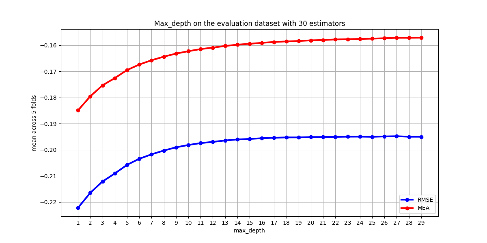

# 04  Übung 

## Beschreibung
Dieser Ordner enthält die Projekt Beschreibung

## Beschreibung der Datensplits
Das Datenset ist nicht gesplittet in Train/Dev/Test Anteile. Um das Datenset zu splitten,müssen zuerst
alle nicht notwendigen Spalten gelöscht werden. Danach kann mit einer sklearn Methode das Datenset in 75% 
Trainingsdaten und 15% Testdaten aufgeteilt werden.
Da das Datenset wie oben beschrieben nicht in Train/Dev/Test Sets aufgeteilt ist aber das Dev Set für das 
Training der Hyperparameter benötigt wird werde ich K fold Cross Validierung benutzten. 
Obwohl dabei ein Teil des Trainingsdatensets für die Validierung genutzt werden muss ist dies immer noch besser
als ein neues Validierungsset suchen zu müssen, dass dann möglicherweise auch nicht die vorgebene Größe von 15% des 
ursprünglichen Datensets hat.

## Werteverteilung für die Spalte "valence"

In dem Plot geht das erste Intervall über 0 hinaus, da [pd.cut]( https://pandas.pydata.org/pandas-docs/stable/reference/api/pandas.cut.html) aus der pandas Biblipthek zu dem ersten Intervall noch 0.1% dazuaddiert. 

| Wertebereich als linksoffenes Intervall      | Anzahl Datenpunkte
|----------------------------------------------|------|
| (0, 0.198]         | 3541 |
| (0.198, 0.396]     | 7668 |
| (0.396, 0.595]     | 9167 |
| (0.595, 0.793]     | 8012 |
| (0.793, 0.991]     | 4426 |
| gesamt             | 32814|

Es gibt insgesamt 1362 verschiedene Werte für die Valence, davon aber nur 68 verschiedene. Dabei treten 247 Werte nur einmal auf 
112 Werte nur 2x mal und 71 Werte nur 3x mal auf. 

Anzahl Datenpunkte pro Häufigkeit:

## Evaluierung der Baselines:
Alle Metriken wurden mit 5 facher Kreuzvalidierung durchgeführt
Dabei benutzt sklearn für die Kreuzvalidierung den negatierten Fehler
für die Vorhersage auf dem Testdatenset aber den nicht negierten Fehler.

root Mean squared error(RMSE):
| Baseline |Durschnitt über 5 Folds| Score auf dem Testdatenset
|----------|:--------------|----|
| Mean Baseline| -0.2325| 0.2348|
| Majority Baseline|-0.5078|0.5056
| Random Baseline mit zufälliger valence 0.402| -0.2550 | 0.2598

absolute error(MAE)

| Baseline |Durschnitt über 5 Folds|Score auf dem Testdatenset
|----------|:--------------|----|
| Mean Baseline| -0.1954| 0.1976
| Majority Baseline|-0.4515| 0.4479
| Random Baseline zufälliger valence 0.402|-0.2119 |0.21558|

Beide Metriken messen wie groß die Differenz ist zwischen dem vorhergesagten valence und der tatsächlichen valence des aktuellen Songs angeben in rationalen Zahlen zwischen 0 und 1 ist. Eine niedriger Wert bedeutet dabei,dass die Vorhersage des Modells recht gut war da die Differenz zwischen dem vorhergesagten und der Gold valence gering ist.
Die Mean Baseline hat dabei für beide Metriken am besten performt, da der Durschnitt etwa 0.51 ist und wiederum im Intervall der häufigsten Werte ist.
Die Majority Baseline hat am schlechsten abgeschnitten denn nur der häufigst Wert für die Valence,0.961 der 69x mal vorkommt liegt nicht in dem liegen nicht in dem häufigsten Intervall.
Da außerdem 5 Werte die 68x mal vorkommen wieder genau in dem häufigsten Intervall in dem auch die Mean Baseline liegt vorkommen ist dies eine weiterer Grund für das schlechtere Abschneiden der Majority Baseline.

## Experimente Resultate

### Optimierung der Hyperparameter für den Decision Tree: 

#### Einfluss der Max Depth: 

|Hyperparameter |  bester RMSE gerundeter Durschnitt über 5 Folds |bester MAE gerundeter Durschnitt über 5 Folds|
|---------------|------------------------------------------------|--------------------|
| Default Decision mit | -0.2139 | -0.1754 |
|min split samples 2-100 | -0.2139 |-0.1754|  2.8592657193308884e-05|
| Friedman Mean Squared Error Splitting Kriterium | -0.2139 | -0.1754 |

### Hyperparameter für den Random Forest:

| Anzahl DT | max_depth | gerundeter höchster RMSE über 5 Folds | dazugehöriger MAE über 5 folds
|-----------|-------------|---------------------------------------|------------------------------|
| 10 | 17 |  -0.1982 | -0.1607 |
| 20 | 23 | -0.1957   |-0.181 |
| 30 | 27 | -0.1948| -0.1571| 

| Anzahl DT | max_depth| gerundeter höchster MEA über 5 Folds | dazugehöriger RMSE über 5 folds
|-----------|-------------|--------------------------------------|----------------------------|
| 10 | 27 |  -0.1601| -0.1991 |
| 20 | 27 | -0.1577   |-0.1958 |
| 30 | 27 | -0.1571| -0.1950| 

### Einfluss der maximalen Tiefe auf den RMSE bzw. MEA:

Der Einfluss des max_depth Parameter wurde jeweils mit 10,20 und 30 Estimators untersucht. 
Die Plots dazu sind sich sehr ähnlich weswegen hier nur der Plot für 30 Estimators augefführt ist.
Die Plots für 10 und 20 estimators kann man im Ordner `plots` nachschauen.

## Hyperparameter der Linearen Regression:
| Modell| gerundeter höchster RMSE über 5 Folds |gerundeter höchster MEA über 5 Folds | Unterschied |std über 5 Folds|
|--------|-------------------------------------|--------------------------------------|------------|-----------------|
| lineares modell mit Intercept | -0.2395 | -0.1808|<0.01| <0.01  |
| lineares Modell ohne Intercept| -0.2345| -0.1785| < 0.01| < 0.01 |

### Lineares Modell mit L2 Regularisierung:

Der Parameter alpha kontrolliert wie stark der Regularisierungsterm 
gewichtet wird. In den beiden Plots kann man erkennen,dass ein Modell
ohne Regularisierung ein sogenannntes OLS am besten performt. 

## Vergleich der Modelle:
| Modell| gerundeter höchster RMSE über 5 Folds |gerundeter höchster MEA über 5 Folds |
|-------|-----------------------|-------------------|
| lineares modell mit Intercept |  -0.2395 | -0.1808|
| lineares Modell ohne Intercept|-0.2345 | -0.1785|
| Decision Tree mit default max_depth|-0.2467| -0.1744|
| Decision Tree mit max_depth=7|-0.2139|-0.1731|
| Default Random Forest mit 30 estimators| -0.1969 |-0.1511|
| Default Random Forest mit 100 estimators| -0.1944 |-0.1478|
| Random Forest mit 30 estimators und max_depth=27 | -0.1948| -0.1571| 

Unterschied 100 Estimators und 30 Estimators <0.01. 

test MEA std 0.0002598188683299422
test RMSE std 0.0006071576937390772

### Feature Importance der einzelnen Spalten
Die angebenen Metriken sind  dabei der Durschnitt über die 5 Folds.

|modell| Feature Kombination | MEA über 5 Folds | RMSE| 
|------|----------------------|---------------------------|-------------------|
| lineares Modell|danceability,track_name,tempo,mode|-0.2144| -0.176
| lineares Modell|track_name,tempo,key,mode|-0.2266| -0.1884|
| Decision Tree| danceability,track_album_name,tempo,mode|-0.2139|-0.175|
| Decision Tree| track_album_name,tempo,key,mode|-0.2268|-0.188|
| Random Forest| | | |

In der Tabelle sind jeweils die Kombination von 3 bzw. 4 verschiedenen Features mit den besten bzw. schlechtechsten RMSE bzw. MEA aufgeführt jeweils gerundet auf 4 Nachkommastellen. Die anderen Werte können in den Dateien im Ordner `evaluation_results` nachgelesen werden.

### von sklearn berechnete Feature Importance: 

|Modell | danceability| tempo|key| mode|
|---------------|-------------|------|---|----|
| Decision Tree | 0.5212      |0.2331|0.0055|0.0015| 
| Random Forest | 0.1887      |0.1507|0.0393|0.0091| 

#### Die 10 wichtigsten Wörter für die Spalte track_name

gemeinsame Wörter: 
| Wort | TF-IDF Wert DT | TF-IDF Wert RDF | Rang DT|Rang RDF|
|------|----------------|---------------------------|--------|------------------|
| feat | 0.013377 | 0.012639 |2|2|
| remix | 0.007273 |  0.0.009445| 6 | 3|
| remastered|0.008607|0.004918| 5 |8|
|version| 0.009785|0.005344|3|7|

Wörter mit höchstem TF-IDF score für den DT: 
| Wort | TF-IDF Wert| 
|------|------------|
| original | 0.017417 | 
| feat | 0.013377|
| version | 0.009785 |
| rock | 0.009003 |
| remastered| 0.008607 |
| remix | 0.007273 | 
| highest | 0.006462 |
| alabama | 0.006200 |
| bad | 0.006026 |
| de | 0.005736 |

|the|0.012662|
|feat |0.010687
|remix|0.009445|
| you| 0.007324|
| me   |0.006757|
| love  |0.005611|
| version |0.005344|
| remastered |0.004918|
| on | 0.004420|
|of | 0.004278|

Wie erwartet gehören zwei Funktionswörter zu den 10 wichtigsten Wörtern, da sie allgemein im Sprachgebrauch sehr oft auftreten 
und deswegen auch entsprechend oft in Album Titeln vorkommt. 
Dies könnte vermieden werden, in dem man eine Liste an Stopwörtern benutzt. 

## Verschiedene Splits der Datensets und die jeweiligen Metriken: 
DT_RMSE:[-0.239, -0.2262, -0.2241, -0.2196, -0.2171, -0.2172, -0.2165, -0.2149, -0.2147, -0.2139] 
DT MEA:[-0.193, -0.1845, -0.1834, -0.1793, -0.1767, -0.1774, -0.1766, -0.1754, -0.1754, -0.175]
RDF_RMSE:[-0.22, -0.2123, -0.2115, -0.2065, -0.2044, -0.2045, -0.2031, -0.2017, -0.201, -0.2002] 
DT MEA:[-0.179, -0.1729, -0.1722, -0.1678, -0.1654, -0.1658, -0.1646, -0.1634, -0.1628, -0.1623]
linear RMSE:[-0.3698, -0.2934, -0.2855, -0.2676, -0.2561, -0.2563, -0.2499, -0.2418, -0.2407, -0.2354] LINEAR MEA:[-0.2724, -0.2229, -0.2172, -0.2027, -0.1934, -0.1921, -0.1874, -0.1828, -0.1817, -0.1781]
