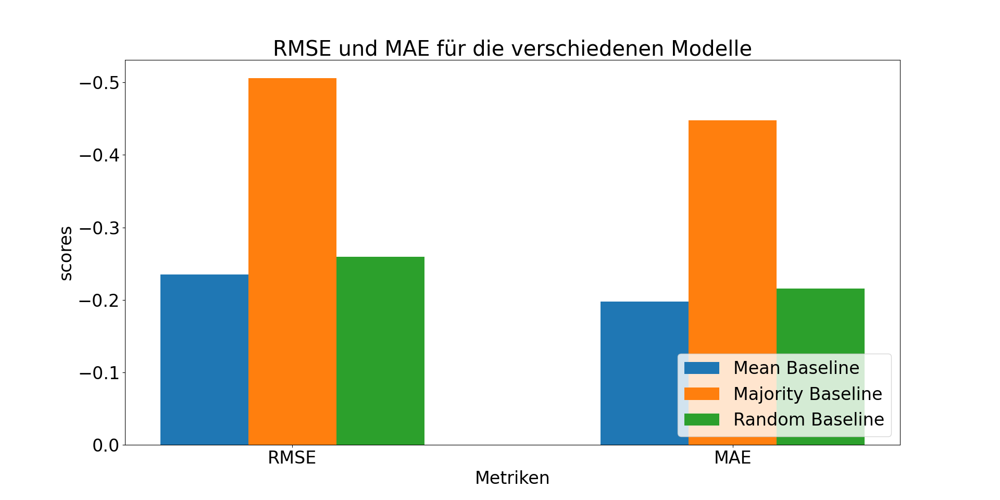

# finales Projekt  
## Inhaltsverzeichnis
- [Ziele](#Ziele)
- [Motivation](#Motivation)
- Datenset  
    - [Überblick über das Datenset](#Überblick-über-das-Datenset)
    - [Feature Auswahl](#Feature-Auswahl)
    - [Preprocessing](#preprocessing)
    - [Train-Test Split](#train-test-split)
    - [Daten Verteilung](#datenverteilung)
- Experimente 
    - [DT](#optimierung-der-hyperparameter-für-den-decision-tree)
- Evaluierung 
    - [Baselines](#evaluierung-der-baselines)

## Ziele 
Das Ziel des Projekt ist es die Stimmung eines Songs als reelle Zahl zwischen 0 und 1 vorherzusagen wobei 
die Stimmung positiver ist je größer die Zahl ist. Dabei wird für das Training ein Datenset von Kaggle mit Spotify
Songs benutzt es handelt sich also um Supervised Learning regression Problem. Daraus ergibt sich eine naheliegende Anwendungsmöglichkeit
und gleichzeitig auch eine Motivation des Projekts nämlich auf Basis der vorhergesagten Stimmung einem potenziellen User weitere Songs zu empfehlen.
Dies ist auf Spotify durchaus relevant für z.B. Themenplaylists wie "Winter mood" oder Playlists die bestimmte Gefühle wecken sollen wie z.B. eine Playlist mit dem Namen"Stimmungsmacher". Außerdem können für den User passende Songvorschläge dazuführen, dass ein User potenziell länger Spotify nutzt,was durchaus 
im Sinne von Spotify ist.

## Motivation
Im Gegensatz zu der meisten Literatur die ich zu diesem Thema gefunde habe beschäftigt werden die Songs nicht klassifiziert sondern 
es handelt sich um Regressionsproblem. Zunächst einmal gibt es dafür den pragmatischen Grund,dass ich kein Datenset gefunden habe, dass
Spotify Songs in Kategorieren einteilt sondern verschiedene Datensets mit Musik aus Indien sowie Datensets mit Musik aus unterschiedlichen Quellen aber
nicht von Spotify. Eine Übersicht dazu gibt es unter [diesem Link](https://github.com/juansgomez87/datasets_emotion).
Dazu habe ich verschiedene wissenschaftliche Quellen gefunden die vorschlagen diese Kategorien für eine Empfehlung von Song zu benutzten.
Der Vorteil bei dem gewählten Datenset ist,dass es von der Spotify API stammt und dadurch die vorhergesagten Werte für die Stimmung 
genutzt werden können um mithilfe der Spotify API Vorschläge zu bekommen und diese dann zu vergleichen mit den Vorschlägen basierend 
auf der tatsächlichen(gold label) Stimmung. 

## Überblick über das Datenset 
Das Datenset enthält 32 verschiedene Features von Songs die zwischen 1960 und 2020 auf Spotify veröffentlicht wurden.
Davon habe ich mir folgende fünf Features ausgesucht.

|track_name	|danceability|tempo|key|mode|valence|
|-----------|------------|-----|---|----|-------|
|Seven Nation Army|0.753|123.913|0|1|0.297|
It's Only Time|0.397|220.252|5|1|0.247|
|cold nights|0.491|49.597|9|0|0.602|
|Decade|0.549|120.994|6|1|0.14|

Dabei ist die danceability ein Wert zwischen 0 und 1 wobei gilt je höher ein Wert desto tanzbarer ist ein Song.
Das Tempo eines Songs ist Beats per minute (bpm) angeben wobei das angebene Tempo das Durschnittstempo des Songs ist.
In dem Datenset kommen dabei für die bpm Werte zwischen 30 und 230 bpm auf, wobei die meisten Werte zwischen 
120 und 130 bpm liegen.
Die Tonart(key) ist dabei als Ganzzahl zwischen 0 und 11 angeben, wobei jede Ganzzahl einer der 12 Halbtonschritte einer
Tonleiter repräsentiert. Zuletzt ist das Tongeschlecht( im Englischen mode) entweder 0,für moll oder 1 für Dur.

## Feature Auswahl
Das Feauture Tempo eines Songs wurde ausgewählt,da schnellere Songs,also jene mit einer höheren bpm, tendenziell vermutlich eine positivere Stimmung besitzt.
Zum Beispiel hat der Song `Seven Nation Army` mit 123 bpm ein Tempo deutlich über der Herzfrequenz von ca.70 bpm liegt,kann diese Song als eher aufputschend 
beschrieben werden kann. Analog wurde das Feature Tanzbarkeit ausgewählt, hier ist die Überlegung dass,ein postivere Song vermutlich eher tanzbarer ist.
Bei dem Song Namen war die Überlegung,dass dieser einen Song gewissermaßen zusammenfassen soll und dadurch Hinweise auf die 
Stimmung gibt. Zudem enthalten manche Songs direkte Hinweis auf eine bestimmte Stimmung z.B.wenn ein Songtitel das Wort Remix 
enthält hat er vermutlich eine eher positive Stimmung. 

Das Tongeschlecht wurde ausgewählt da Dur im Gegensatz zu Moll eher fröhlich klingt also tendenziell bei Songs mit einer positiveren 
Stimmung benutzt wird. Die Tonart wurde ausgewählt weil bestimmten Tonarten bestimmten Attributen zugewiesen werden wie z.B.leicht für C-Dur
die ebenfalls einen auf die Stimmung haben können. Allerdings ist die Zuschreibung umstritten und der wesentlichere Grund ist,dass
das ursprünglich geplante Feauture Laustärke in db nicht genutzt weden da es selbst mit einer Skalierung nicht möglich war die 
Werte in das in dem [README des Datensets](data/readme_dataset.md) angebene Intervall zwischen -60 und 0 zu bringen. 

## Preprocessing
Bevor das Datenset zum Trainieren genutzt werden konnte musste es in 3 Schritten aufbereitet werden.
Zunächst einmal mussten einige Wörter aus den 4 Feature Spalten mit numerischen Werten entfernt werden.
Danach mussten die Wertebereiche für die Features danceability,valence  und tempo zwischen 0 und 1 skaliert 
werden,denn ursprünglich waren,anders als im [README des Datensets](data/readme_dataset.md) angeben einige Werte nicht zwischen 0 und 1. 
Dabei sind leider einige sehr kleine Werte für die Valence entstanden z.B.0,0064 die zwar prinzipiell möglich sind
aber für sich genommen wenig Sinn ergeben. Nach diesen Schritten sind den ursprünglich 32.833 Songs noch 
32.714 Songs verblieben. Als letzten Schritt musste der Songname mit TF-IDF noch in Vektoren umgewandelt werden damit 
er als Input für ein ML Modell dienen kann.

## Train-Test Split  
Das Datenset wurde gesplittet in 60% Trainingsdaten und 25% Testdaten.
Aus den Trainingsdaten wurde mit 5-facher Kreuzvalidierung ein Evaluierungsdatenset 
erstellt das insgesamt 15% des Datenset ausmacht. Obwohl bei diesem Vorgehen ein Teil des Trainingsdatensets
für die Validierung genutzt werden muss ist dies immer noch besser als ein neues Validierungsset suchen zu müssen, 
dass dann möglicherweise auch nicht die vorgebene Größe von 15% des  ursprünglichen Datensets hat.

## Datenverteilung 
Zuerst wurden mithilfe von Truncated SVD die vier ausgewählten Features zur besseren Visualisierung auf 2 Dimensionen reduziert.
Das Ergebnis ist in den beiden Plots unten zu sehen,wobei in der 2D Darstellung transparente Punkte zu den Testdatensatz gehören.
 
 

Die beiden Plots illustrieren dabei,dass die Werte für die Valence bis auf wenige Ausnahmen gleichmäßig verteilt sind, in keiner der beiden Dimensionen 
sammeln sich die Werte an einem Punkt oder an einem der beiden Minima bzw. Maxima. Die einzigen Aureißer sind Datenpunkte bei der die valence 0 ist nahe dem Ursprung und dem Punkt(x_max,y_max). 

Als nächstes schauen wir uns die Verteilung der Valence unabhängig von den Features an. Dabei geht in dem Plot  das erste Intervall über 0 hinaus, da [pd.cut]( https://pandas.pydata.org/pandas-docs/stable/reference/api/pandas.cut.html) aus der pandas Biblipthek zu dem ersten Intervall noch 0.1% dazuaddiert. Dies hat aber keine Einfluss auf die Anzahl an Datenpunkte
da der minimale Wert für die valence 0 ist. Bei dem Plot fällt auf,dass die Verteilung der Werte einer Glockenkurve ähnelt, mit den meisten Werten,9167 Songs, im Intervall welches den Mittelwert von ca 0.51 enthält. Allerdings sind im dem Intervall rechts des mittleren mit 8012 Songs deutlich mehr Datenpunkte enthalten 
als im dem Intervall linkes des mittlere mit 7668. Die beiden äußersten Intervalle enthalten dagegen etwa gleich viele Datenpunkte. 
Insgesamt gibt es 1362 verschiedene Werte für die Valence, davon aber nur 68 verschiedene. Dabei treten 247 Werte nur einmal auf 
112 Werte nur 2x mal und 71 Werte nur 3x mal auf. 

## Baselines
Insgesamt wurden drei verschiedene Baselines implementiert. Die Mean und die Majority Baseline nehmen dabei den Mittelwert von ca. 0.51 bzw den häufigsten 
Wert von ca 0.961 als Vorraussage. Die Random Baseline dagegen zieht bei der Initialisierung einen zufälligen Wert aus dem Datenset und berücksichtigt dabei die 
oben beschriebene Werteverteilung. Für jeden Wert nimmt die Random Baseline dann den am Anfang zufällig gezogen Wert als Vorrausage.

## Evaluierung der Baselines:
Die Evaluierung wurden mit  mit 5 facher Kreuzvalidierung durchgeführt.Dabei benutzt sklearn für die Kreuzvalidierung den negatierten Fehler
für die Vorhersage auf dem Testdatenset aber den nicht negierten Fehler.

Dabei messen beide Metriken messen wie groß die Differenz ist zwischen dem vorhergesagten valence und der tatsächlichen valence des aktuellen Songs angeben in rationalen Zahlen zwischen 0 und 1 ist. Eine niedriger Wert bedeutet dabei,dass die Vorhersage des Modells recht gut war da die Differenz zwischen dem vorhergesagten und der Gold valence gering ist. Dabei kann der Root Mean Squared Error(im Folgenden RMSE) als die Standardabweichung der Residuals die sich aus der Differenz zwischen der Vorhersage und dem tatsächlichen Wert berechnen interpretiert werden.

Die Mean Baseline hat dabei für beide Metriken am besten performt,sie liegt mit einem MAE von gerundet -0.2348 etwa im Durschnitt etwa 23% neben dem tatsächlichen 
Wert bei einer Standardabweichung von ca. 19%. Der Grund warum die Mean Baseline so gut abschneidet ist,dass der Durschnitt von etwa 0.51 im Intervall der häufigsten Werte liegt. Dadurch ist der Fehler der Mean Baseline in diesem Intervall schon mal kleiner als die Intervallbreite von 0.2 wodurch sich für die meisten Werte 
eben jener niedriger Fehler ergibt. Für die Werte in dem linken Intervall,jenes mit den zeit häufigsten Werten ergibt sich ebenso ein Fehler von maximal 0.25 da der größte Wert in diesem Intervall ca. 0.795 der Fehler ca. 0.795-0.51 $\approx$ 0.25 ist. Zudem liegen die 5 häufigsten Werte welche jeweils 68x vorkommen wieder genau in dem häufigsten Intervall in dem auch die Mean Baseline liegt was wiederum ein Grund für die Performanz er Mean Baseline ist. Analog dazu hat die Majority Baseline hat am schlechsten abgeschnitten denn der häufigst Wert für die Valence,0.961,liegt nicht in dem liegen nicht in dem häufigsten Intervall in dem auch der Mittelwert liegt.

## Decision Tree
Bevor wir die Resultate mit dem Decision Tree(DT) diskutieren schauen wir uns in dem Plot unten die Decision Boundary des optimierten Decision Trees an.
Dabei wurden die 4 verwendeten Features wie bereits zuvor mit Truncated SVD auf 2 Dimensionen reduziert.

Anhand des Plots kann man gut erkennen dass ein DT für Regression wie jener für Klassifikation den zweidimensionalen Raum in dem die Werte für die Stimmung 
geplottet wurden in verschiedene kleinere Bereiche unterteilt.Dabei wird für jeden Wert in einem Bereich,der ein Blatt in dem DT darstellt, der Mittelwert der Werte für die Blätter als Vorhersage genutzt.Durch die Aufteilung des Raumes kann ein DT die glockenkurven ähnliche Funktion die im vier dimensionalen Raum die Verteilung 
der Werte für die Stimmung modelliert approximieren.

Ein Decision Tree hat dabei den Vorteil dass er leicht zu interpretieren,da er durch seine Baumstruktur als eine Kaskade von if-else Abfragen aufgefasst werden kann.
Außerdem ist er vergleichsweise schneller Algorithmus, von den in diesem Projekt ausprobierten Algorithmen war bis auf die Baselines nur die Lineare Regression schneller. Ein Nachteil ist,dass Decision Tree anfällig für Overfitting sind. Um Overfitting zu vermeiden habe ich verschiedene Hyperparameter des DT ausprobiert.Die Ergebnisse der Hyperparamter Optimierung in dem nächsten Abschnitt beschrieben werden.

## Optimierung der Hyperparameter für den Decision Tree: 

Wie in dem Plot zu erkennen ist,verschlechtert der RMSE ab einer max_depth von 7 schneller ab als der MAE sich verbessert. Die blaue bzw. orange Fächen um die Kurven sind dabei die jeweilige Standabweichung bei der durschnitttlichen Wert über 5 Folds. Zusammenfassend habe ich mich für eine `max_depth` von 7 entschieden,da sich ab diesem Wert die Vorhersage nicht bessert aber die Standardabweichung des Fehler,der RMSE, sich vergrößert.

Als nächstes habe ich das Splitting Kriterium `Friedman MSE` welches eine verbesserte Version des des standarmäßigen Kriterium `MSE` ist,angeschaut. 
Das Splitting Kriterium bestimmt welche Metrik an jedem Knoten berechnet wird um die verbliebenen Datenpunkte weiter aufzuteilen.

Wie in dem Plot zu erkennen ist,sind die Resultate nahezu identisch wobei der DT mit dem Standardkriterium leicht besser abschneidet.
Zum Schluss habe ich noch den Hyperparameter `min_split_samples` 
ausprobiert mit jedoch nur einem geringen Einfluss auf die beiden Metriken. Insgesamt habe ich nur die `max_depth`des DT auf 7 gesetzt und
ansonsten die Default Werte für die getesteten Hyperparameter genutzt.
Alle Ergebnisse der Hyperparameter Optimierung können in den jeweiligen 
csv Dateien in dem  Ordner [evaluation_results](evaluation_results) angesehen werden.

## Random Forest
Bevor wir die Resultate mit dem Random Forest(RDF) diskutieren schauen wir uns in dem Plot unten die Decision Boundary des optimierten RDF an.
Dabei wurden die 4 verwendeten Features wie bereits zuvor mit Truncated SVD auf 2 Dimensionen reduziert.

Anhand des Plots kann man gut erkennen dass ein DT für Regression wie jener für Klassifikation den zweidimensionalen Raum in dem die Werte für die Stimmung 
geplottet wurden in verschiedene kleinere Bereiche unterteilt.Dabei wird für jeden Wert in einem Bereich,der ein Blatt in dem DT darstellt, der Mittelwert der Werte für die Blätter als Vorhersage genutzt.Durch die Aufteilung des Raumes kann ein DT die glockenkurven ähnliche Funktion die im vier dimensionalen Raum die Verteilung 
der Werte für die Stimmung modelliert approximieren.

### Hyperparameter für den Random Forest:

| Anzahl DT | max_depth | gerundeter höchster RMSE über 5 Folds | dazugehöriger MAE über 5 folds
|-----------|-------------|---------------------------------------|------------------------------|
| 10 | 17 |  -0.1982 | -0.1607 |
| 20 | 23 | -0.1957   |-0.181 |
| 30 | 27 | -0.1948| -0.1571| 

| Anzahl DT | max_depth| gerundeter höchster MEA über 5 Folds | dazugehöriger RMSE über 5 folds
|-----------|-------------|--------------------------------------|----------------------------|
| 10 | 27 |  -0.1601| -0.1991 |
| 20 | 27 | -0.1577   |-0.1958 |
| 30 | 27 | -0.1571| -0.1950| 

### Einfluss der maximalen Tiefe auf den RMSE bzw. MEA:

Der Einfluss des max_depth Parameter wurde jeweils mit 10,20 und 30 Estimators untersucht. 
Die Plots dazu sind sich sehr ähnlich weswegen hier nur der Plot für 30 Estimators augefführt ist.
Die Plots für 10 und 20 estimators kann man im Ordner `plots` nachschauen.

## Hyperparameter der Linearen Regression:
| Modell| gerundeter höchster RMSE über 5 Folds |gerundeter höchster MEA über 5 Folds | Unterschied |std über 5 Folds|
|--------|-------------------------------------|--------------------------------------|------------|-----------------|
| lineares modell mit Intercept | -0.2395 | -0.1808|<0.01| <0.01  |
| lineares Modell ohne Intercept| -0.2345| -0.1785| < 0.01| < 0.01 |

### Lineares Modell mit L2 Regularisierung:

Der Parameter alpha kontrolliert wie stark der Regularisierungsterm 
gewichtet wird. In den beiden Plots kann man erkennen,dass ein Modell
ohne Regularisierung ein sogenannntes OLS am besten performt. 

## Vergleich der Modelle:
| Modell| gerundeter höchster RMSE über 5 Folds |gerundeter höchster MEA über 5 Folds |
|-------|-----------------------|-------------------|
| lineares modell mit Intercept |  -0.2395 | -0.1808|
| lineares Modell ohne Intercept|-0.2345 | -0.1785|
| Decision Tree mit default max_depth|-0.2467| -0.1744|
| Decision Tree mit max_depth=7|-0.2139|-0.1731|
| Default Random Forest mit 30 estimators| -0.1969 |-0.1511|
| Default Random Forest mit 100 estimators| -0.1944 |-0.1478|
| Random Forest mit 30 estimators und max_depth=27 | -0.1948| -0.1571| 

Unterschied 100 Estimators und 30 Estimators <0.01. 

test MEA std 0.0002598188683299422
test RMSE std 0.0006071576937390772

### Feature Importance der einzelnen Spalten
Die angebenen Metriken sind  dabei der Durschnitt über die 5 Folds.

|modell| Feature Kombination | MEA über 5 Folds | RMSE| 
|------|----------------------|---------------------------|-------------------|
| lineares Modell|danceability,track_name,tempo,mode|-0.2144| -0.176
| lineares Modell|track_name,tempo,key,mode|-0.2266| -0.1884|
| Decision Tree| danceability,track_album_name,tempo,mode|-0.2139|-0.175|
| Decision Tree| track_album_name,tempo,key,mode|-0.2268|-0.188|
| Random Forest| | | |

In der Tabelle sind jeweils die Kombination von 3 bzw. 4 verschiedenen Features mit den besten bzw. schlechtechsten RMSE bzw. MEA aufgeführt jeweils gerundet auf 4 Nachkommastellen. Die anderen Werte können in den Dateien im Ordner `evaluation_results` nachgelesen werden.

### von sklearn berechnete Feature Importance: 

|Modell | danceability| tempo|key| mode|
|---------------|-------------|------|---|----|
| Decision Tree | 0.5212      |0.2331|0.0055|0.0015| 
| Random Forest | 0.1887      |0.1507|0.0393|0.0091| 

#### Die 10 wichtigsten Wörter für die Spalte track_name

gemeinsame Wörter: 
| Wort | TF-IDF Wert DT | TF-IDF Wert RDF | Rang DT|Rang RDF|
|------|----------------|---------------------------|--------|------------------|
| feat | 0.013377 | 0.012639 |2|2|
| remix | 0.007273 |  0.0.009445| 6 | 3|
| remastered|0.008607|0.004918| 5 |8|
|version| 0.009785|0.005344|3|7|

Wörter mit höchstem TF-IDF score für den DT: 
| Wort | TF-IDF Wert| 
|------|------------|
| original | 0.017417 | 
| feat | 0.013377|
| version | 0.009785 |
| rock | 0.009003 |
| remastered| 0.008607 |
| remix | 0.007273 | 
| highest | 0.006462 |
| alabama | 0.006200 |
| bad | 0.006026 |
| de | 0.005736 |

|the|0.012662|
|feat |0.010687
|remix|0.009445|
| you| 0.007324|
| me   |0.006757|
| love  |0.005611|
| version |0.005344|
| remastered |0.004918|
| on | 0.004420|
|of | 0.004278|

Wie erwartet gehören zwei Funktionswörter zu den 10 wichtigsten Wörtern, da sie allgemein im Sprachgebrauch sehr oft auftreten 
und deswegen auch entsprechend oft in Album Titeln vorkommt. 
Dies könnte vermieden werden, in dem man eine Liste an Stopwörtern benutzt. 

## Verschiedene Splits der Datensets und die jeweiligen Metriken: 
DT_RMSE:[-0.239, -0.2262, -0.2241, -0.2196, -0.2171, -0.2172, -0.2165, -0.2149, -0.2147, -0.2139] 
DT MEA:[-0.193, -0.1845, -0.1834, -0.1793, -0.1767, -0.1774, -0.1766, -0.1754, -0.1754, -0.175]
RDF_RMSE:[-0.22, -0.2123, -0.2115, -0.2065, -0.2044, -0.2045, -0.2031, -0.2017, -0.201, -0.2002] 
DT MEA:[-0.179, -0.1729, -0.1722, -0.1678, -0.1654, -0.1658, -0.1646, -0.1634, -0.1628, -0.1623]
linear RMSE:[-0.3698, -0.2934, -0.2855, -0.2676, -0.2561, -0.2563, -0.2499, -0.2418, -0.2407, -0.2354] LINEAR MEA:[-0.2724, -0.2229, -0.2172, -0.2027, -0.1934, -0.1921, -0.1874, -0.1828, -0.1817, -0.1781]

Dabei habe ich mich bewusst dagegen entschieden die  verschiedenen Werte für die Stimmung
zwischen 0 und 1 in Kategorien aufzuteilen denn ich finde es schwierig sinnvolle verschiedene Abstufungen von z.B. positiver Stimmung 
zu finden und eine Rangordnung der Abstufungen zu definieren. Besonders schwierig erschien mir eine Unterscheidung zwischen den 
niedrigsten positiven Stimmung und der höchsten negativen Stimmung. 
Um die vorhergesagte Stimmung dennoch interpretieren zu können,kann man z.B. definieren dass der Wert 0.7 bedeutet,dass der Song 
zu 70% eine positive Stimmung hat. Dies ist zwar weniger anschaulich und übersichtlicher als die Songs in verschiedene Kategorien zu ornden 
hat aber den Vorteil, dass z.B. plötzliche Stimmungswechsel innerhalb eines Songs berücksichtigt werden.
Außerdem wird so das Problem,dass ein Song potenziell zu zwei verschiedenen Kategorien gehören kann,z.B
"ernergetic" und "happy", abgeschwächt. 